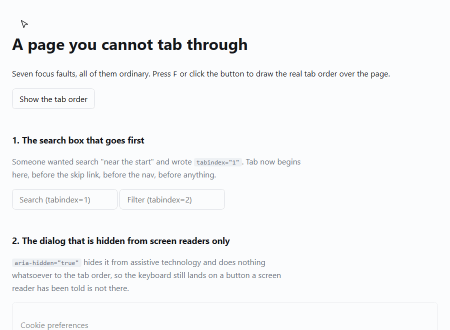

# whyfocus

[](https://github.com/GeoCodeCrafter/whyfocus/actions/workflows/ci.yml)
[](LICENSE)

Draws the real tab order over a page, and tells you why anything unreachable got
skipped.

**[Try it →](https://geocodecrafter.github.io/whyfocus/)** — a page with seven
ordinary focus faults. Press <kbd>F</kbd>.



Focus starts on the search box in the middle of the page, because somebody wrote
`tabindex="1"` on it. The line doubling back is what that looks like.

```
button.close is not reachable by Tab.

  div.modal is inert, and everything inside an inert subtree is unfocusable
  The cause is on div.modal, not on the element itself.

  Fix: Remove the inert attribute from that element, usually when the
       dialog over it closes.
  [inert]
```

---

## Why

Accessibility tooling is very good at telling you a rule failed and very bad at
telling you why the browser did what it did.

"Element is not keyboard accessible" is true and useless. The thing you need to
know is that a `div` four levels up has `aria-hidden="true"` on it, or that
somebody put `tabindex="1"` on the search box and now Tab starts there instead of
at the top of the page.

The good news is that the list of reasons is **closed**. A browser doesn't decide
focusability by vibes — there are eight or nine documented rules, and every one
of them is readable from computed style, an attribute, or the box. So this never
guesses. If none of the rules match, the element is tabbable and that's the end
of it.

## What it tells you

**The order.** Numbered badges on every focus stop, joined by a line in the order
Tab visits them. A list of stops is a list. A line that doubles back on itself is
obviously wrong from across the room.

**Why anything was skipped**, with the cause named on the element that carries it:

| Reason | What it means |
| --- | --- |
| `negative-tabindex` | Focusable by script, skipped by Tab |
| `disabled` | Including inherited from a `fieldset` — and the first `<legend>` exception |
| `display-none` | Named on the ancestor that set it, not on the element |
| `visibility-hidden` | Named on the outermost ancestor that set it, since it inherits |
| `hidden-attribute` | Reported separately from plain `display: none` |
| `inert` | The whole subtree, and the correct fix for most of the others |
| `not-interactive` | A `div` is a `div` |

**And four things worth flagging:**

- **positive tabindex** — it doesn't move something *earlier*, it moves it in
  front of the entire document
- **focusable content inside `aria-hidden`** — the keyboard lands on something a
  screen reader has been told doesn't exist. WCAG 4.1.2, and the most common way
  to fail it
- **tab order that disagrees with the layout** — `order` and `grid-area` move
  boxes, never the tab order
- **focus stops with no size** — focus goes there and nothing appears to happen

## The test that matters

Everything in the unit suite checks my model of the focus order against numbers I
typed in myself. That proves the model is self-consistent and nothing else.

So the Playwright suite presses Tab in a real Chromium, records where focus
actually lands, and asserts the model predicted it exactly:

```ts
const predicted = await page.evaluate(() => whyfocus.order().map(describe));
const real = await realTabOrder(page, predicted.length + 4);

expect(real.slice(0, predicted.length)).toEqual(predicted);
```

**It failed the first time I ran it**, and it was right to. I had a rule saying
zero-size elements can't be focused. They can — Chromium focuses a 0×0 element
quite happily, because "being rendered" doesn't exclude having no area. Only
`display: none` and `visibility: hidden` actually remove focusability.

So that rule was wrong, and the correct behaviour turns out to be more
interesting: a zero-size focus stop isn't skipped, it's *worse* than skipped.
Focus goes there, the focus ring has nothing to draw, and a keyboard user sees
nothing move. It's a finding now rather than a skip reason.

If the model and the browser ever disagree again, the model is wrong.

## Use it

Nothing to install — build it and drag `dist/bookmarklet.js` into a bookmark. One
file, no dependencies, works on any site with no extension and no permission
prompt.

Or from a test:

```ts
import { explain, order, problems } from 'whyfocus';

expect(problems(document.body)).toEqual([]);
expect(explain(closeButton).tabbable).toBe(true);
```

```bash
npm install
npm run demo      # the broken page on :5173
npm test
npm run test:e2e  # the Tab-pressing suite
```

## How it's built

The rules never touch the DOM. They read the page through an injected
`Inspector`, partly so they can be tested at all — jsdom does no layout, so
anything asking the real DOM for a box gets zeroes and every size rule silently
passes — and mostly so each rule has to declare what it looked at.

```
src/
  engine/     focusable, order, audit — pure functions over an Inspector
  inspect/    the real one, and the interface the rules see
  report/     findings -> English
  ui/         the overlay
```

49 unit tests and 5 Playwright tests.

## Not done yet

- Shadow DOM isn't traversed, and delegated focus inside a shadow root will be
  missed entirely.
- Radio groups are treated as individual stops. The browser treats a checked
  group as one.
- No `Shift+Tab` verification, though the order is symmetric so it should hold.
- Scrollable containers are focusable in some browsers and not others. Not
  handled either way rather than handled wrongly.

## The GIF above

Generated, not screen-recorded — `npm run demo:gif`. Playwright drives the page
and `gifenc` encodes the frames, because Playwright's own ffmpeg is a stripped
webm-only build with no GIF muxer.

## Licence

MIT
